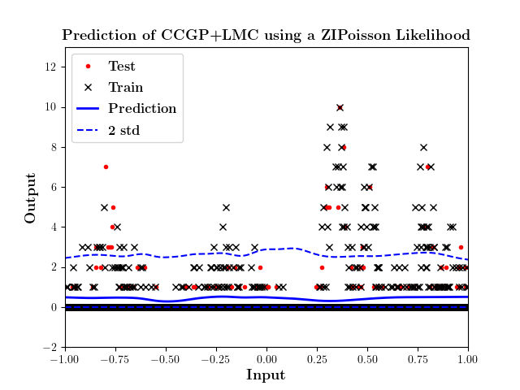
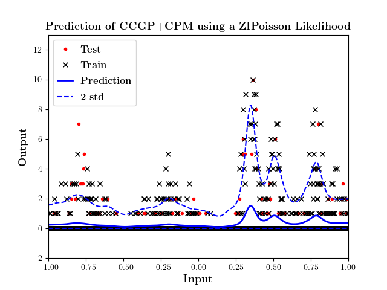
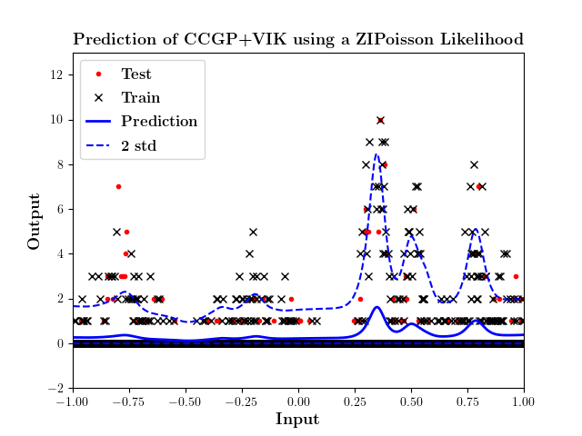
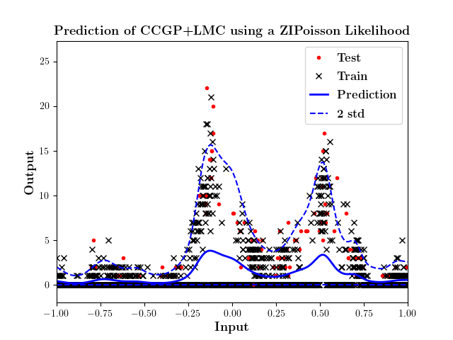
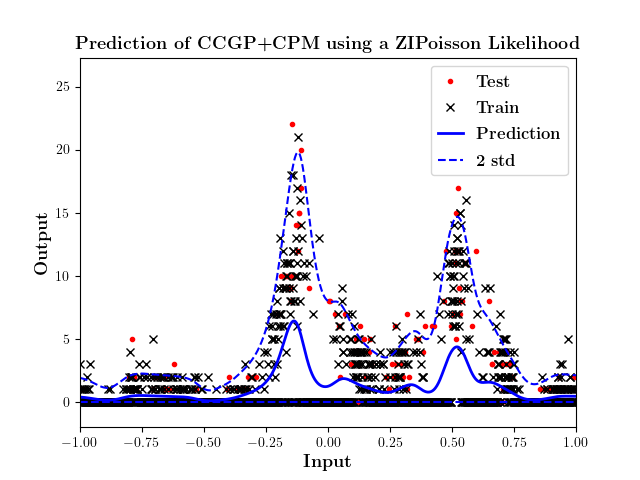
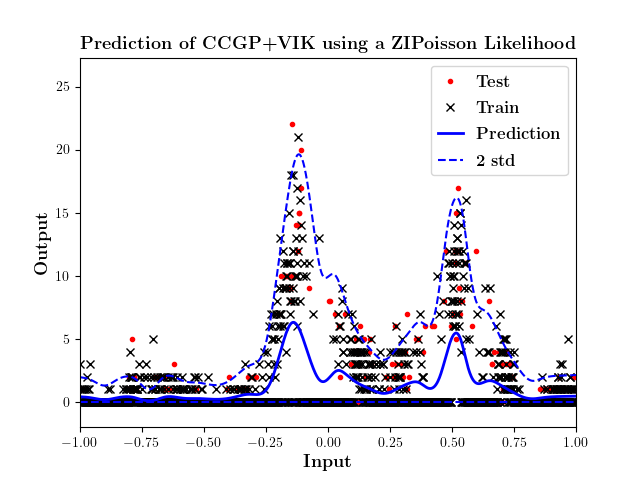

# Correlated Chained GPs based on Convolution Processes and Variational Inducing Kernels

This repository contains the implementation of three stochastic variational inference models: 1. The HetMOGP based on a Linear Model of Coregionalisation (LMC) 2. The Correlated Chained GP with a Convolution Processes Model (CPM) and 3. The Correlated Chained GP with Variational Inducing Kernels (VIKs).

The repository consists of: 

- **CCGP_with_LMC_CPM_VIK.py**: This is a python code that allows to run different toy datasets to be fitted with any of the GP options based on either LMC, CPM or VIKs.

- **load_datasets_TransportPaper.py**: This module contains different toy examples with different number of Heterogeneous Outputs. 

The following modules are a Forked version of [Pablo Moreno](https://github.com/pmorenoz/HetMOGP)'s implementation. We recommend the user to work using this package version:
- **hetmogp**: This block contains all model definitions, inference, and important utilities. 
- **likelihoods**: General library of probability distributions for the heterogeneous likelihood construction.

## Usage

The modules of this repository have been tested in **Python 3.6** and mainly rely on:
* **GPy toolbox** which can be installed with:
```
pip install gpy
```
* A **forked version** of **Climin** which includes the variational optimisation optimiser **VarOpt**, it should be installed as:
```
git clone https://github.com/juanjogg1987/climin
cd climin
pip install .
```

* The HetMOGP with LMC is created as:
```
model = SVMOGP(X=X, Y=Y, Z=Z, kern_list=kern_list, likelihood=likelihood, Y_metadata=Y_metadata, batch_size=batch)
```

* The CCGP with CPM is created as:
```
model = ConvHetMOGP(X=X, Y=Y, Z=Z.copy(), kern_list_uq=kern_list, kern_list_Gx=kern_list_Gx,likelihood=likelihood, Y_metadata=Y_metadata, batch_size=batch)
```

* The CCGP with VIKs is created as:
```
model = ConvHetMOGP_VIK(X=X, Y=Y, Z=Z.copy(), kern_list_uq=kern_list,kern_list_Gx=kern_list_Gx,kern_list_Tq=kern_list_Tq, likelihood=likelihood, Y_metadata=Y_metadata,batch_size=batch)
```

## Example 1:
* **Toy dataset zip_conv1 using a Zero-Inflated Likelihood** The figures shows the Predictive Performance of each of the models based on either LMC, CPM or VIKs. 



## Example 2:
* **Toy dataset zip_conv2 using a Zero-Inflated Likelihood** The figures shows the Predictive Performance of each of the models based on either LMC, CPM or VIKs. 




## Contributors

[Juan-José Giraldo](https://github.com/juanjogg1987) and [Mauricio A. Álvarez](https://sites.google.com/site/maalvarezl/)

For further information or contact:
```
jjgiraldogutierrez1@sheffield.ac.uk or juanjogg1987@gmail.com
